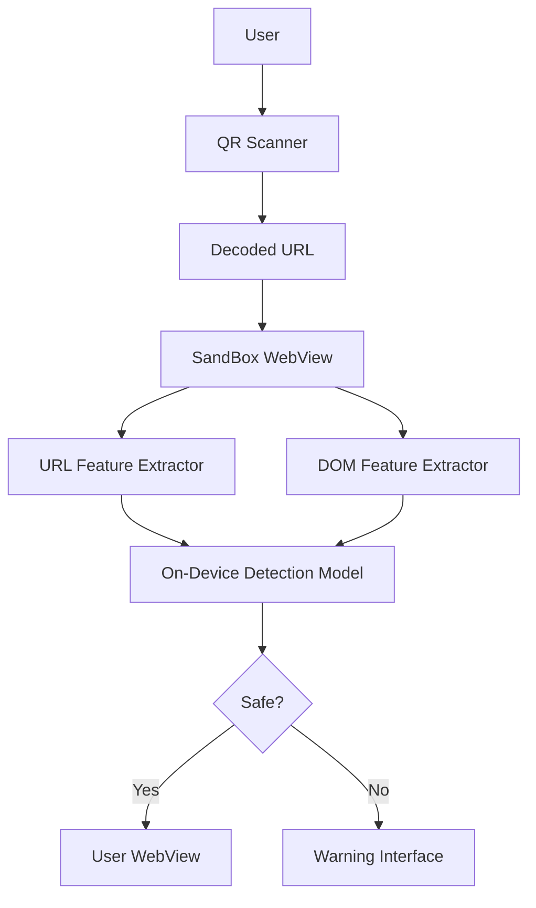

# QUASAR Shield
## Conceptualization Document

  

**Student No.** [22112053]
**Name** [최형규]
**E-mail** [kgyu517@yu.ac.kr]

\newpage

---

## Revision history

| Revision date | Version # | Description | Author |
|---|---:|---|---|
| 2026-03-27 | 1.0.0 | First draft | [최형규] |

---

## Contents

1. Business purpose  
2. System context diagram  
3. Use case list  
4. Concept of operation  
5. Problem statement  
6. Glossary  
7. References  

---

# 1. Business purpose

## 1.1 Project background

QR 코드는 모바일 결제, 출입 인증, 간편 로그인 등 다양한 환경에서 널리 사용되고 있다. 그러나 QR 코드는 스캔하기 전까지 내부에 어떤 URL이 포함되어 있는지 사용자가 직접 확인하기 어렵다는 특성이 있다. 이로 인해 공격자는 정상 포스터, 안내문, 전단지, 스티커 등에 악성 QR 코드를 삽입하거나 기존 QR 코드를 위변조하여 사용자를 피싱 페이지로 유도할 수 있다.

기존의 QR 피싱 탐지 방식은 주로 중앙 서버에 URL을 업로드하여 블랙리스트를 대조하거나 서버 측 모델로 판별하는 구조를 사용한다. 하지만 이러한 방식은 사용자의 접속 정보가 외부 서버에 전달될 수 있어 프라이버시 문제가 발생할 수 있고, 네트워크 상태나 서버 가용성에도 영향을 받는다. 또한 일부 방식은 사용자가 이미 페이지를 연 뒤에야 필터링이 동작하므로, 실제로는 "들어가 보기 전에 막아 주는" 보호가 충분하지 않다.

이러한 문제를 해결하기 위해 본 프로젝트는 논문에서 제안한 QUASAR 프레임워크를 모바일 애플리케이션 형태로 구현하는 것을 목표로 한다. 본 앱은 QR 스캔 직후 URL을 일반 브라우저나 사용자 WebView에 바로 넘기지 않고, 먼저 분석 전용 SandBox WebView에 로드한다. 이후 URL 문자열 특징과 초기 DOM 특징을 추출하여 온디바이스 경량 모델로 피싱 여부를 판별하고, 안전하다고 판단된 경우에만 실제 페이지 접근을 허용한다.

즉, 본 프로젝트는 **QR 스캔 직후의 선제적 검증**, **외부 서버 비의존 온디바이스 탐지**, **샌드박스 기반 격리**를 통해 사용자의 프라이버시와 안전성을 동시에 강화하는 QR 피싱 방어 애플리케이션을 구현하고자 한다.

## 1.2 Goal

- QR 코드 스캔 직후 URL을 선제적으로 검증하는 모바일 보안 애플리케이션 개발
- 사용자 WebView와 분리된 SandBox WebView를 기반으로 안전한 분석 환경 제공
- URL 기반 피처와 초기 DOM 기반 피처를 활용한 온디바이스 정적 피싱 탐지 수행
- 외부 서버로 URL 및 페이지 내용을 전송하지 않는 탈중앙화 구조 구현
- 실시간에 가까운 지연 시간으로 사용자 경험을 해치지 않는 보안 서비스 제공

## 1.3 Target Market

- 출처가 불분명한 QR 코드를 자주 스캔하는 일반 스마트폰 사용자
- 포스터, 전단지, 공공장소 안내물의 QR 코드를 자주 이용하는 사용자
- 모바일 간편 로그인, 결제, 출입 인증 서비스를 자주 사용하는 사용자
- 외부 서버 전송 없이 프라이버시 친화적 보안 기능을 원하는 사용자 및 기관

---

# 2. System context diagram

아래는 본 프로젝트의 system context를 텍스트 형태로 정리한 것이다.

- **User** : QR 코드를 스캔하고 결과를 확인하는 사용자
- **QR Scanner** : QR 코드를 인식하고 URL을 디코딩하는 모듈
- **SandBox WebView** : 사용자 WebView와 분리된 분석 전용 가상 환경
- **URL Feature Extractor** : URL 길이, 서브도메인 깊이, 숫자/특수문자 비율 등의 정적 특징 추출 모듈
- **DOM Feature Extractor** : 초기 DOM에서 form 태그 수, 로그인 폼 존재 여부, 리다이렉트 관련 정보 등을 추출하는 모듈
- **On-Device Detection Model** : 추출된 피처를 바탕으로 피싱 여부를 판별하는 경량 모델
- **Decision Module** : 판별 결과에 따라 실제 접속 허용 또는 차단을 결정하는 모듈
- **User WebView** : 안전하다고 판단된 경우에만 실제 페이지를 렌더링하는 사용자용 WebView
- **Warning Interface** : 피싱 의심 시 경고 메시지를 출력하고 접속을 차단하는 화면

### System flow

1. 사용자가 QR 코드를 스캔한다.  
2. QR Scanner가 QR 내부 URL을 디코딩한다.  
3. 디코딩된 URL은 즉시 사용자 브라우저로 열리지 않고 SandBox WebView에 먼저 로드된다.  
4. 시스템은 URL Feature Extractor와 DOM Feature Extractor를 통해 정적 피처를 추출한다.  
5. On-Device Detection Model이 해당 URL의 피싱 여부를 판별한다.  
6. 안전하다고 판단되면 User WebView에서 실제 페이지를 연다.  
7. 피싱으로 판단되면 Warning Interface를 통해 경고를 출력하고 접근을 차단한다.  

### Mermaid diagram

---

# 3. Use case list

## 3.1 Scan QR Code
**Actor** User  
**Description** 사용자가 앱을 통해 QR 코드를 스캔한다.

## 3.2 Decode URL
**Actor** QR Scanner  
**Description** 스캔된 QR 코드에서 URL을 추출한다.

## 3.3 Load URL in SandBox WebView
**Actor** System  
**Description** 추출된 URL을 사용자 WebView가 아닌 SandBox WebView에 우선 로드한다.

## 3.4 Extract URL Features
**Actor** System  
**Description** URL 길이, 서브도메인 깊이, 숫자 비율, 특수문자 비율 등 URL 기반 정적 특징을 추출한다.

## 3.5 Extract Initial DOM Features
**Actor** System  
**Description** 페이지 로드 직후 DOM에서 form 태그 수, 로그인 폼 존재 여부, 리다이렉트 관련 태그 등 초기 구조 특징을 추출한다.

## 3.6 Run On-Device Detection
**Actor** On-Device Detection Model  
**Description** 추출된 URL/DOM 피처를 입력으로 받아 피싱 여부를 판별한다.

## 3.7 Allow Safe Access
**Actor** Decision Module, User WebView  
**Description** 분석 결과가 정상으로 판단되면 실제 페이지를 사용자 WebView에서 연다.

## 3.8 Block Suspicious Access
**Actor** Decision Module, Warning Interface  
**Description** 분석 결과가 피싱 의심으로 판단되면 경고를 표시하고 실제 페이지 접근을 차단한다.

## 3.9 View Detection Result
**Actor** User  
**Description** 사용자는 해당 QR 코드가 안전한지 또는 위험한지 결과를 확인한다.

---

# 4. Concept of operation

## 4.1 Scan QR Code
**Purpose**  
사용자가 QR 코드를 통해 웹페이지에 접근하기 전에 보안 검사를 시작하기 위함이다.

**Approach**  
앱은 카메라를 이용해 QR 코드를 인식하고 내부에 포함된 URL을 디코딩한다.

**Dynamics**  
사용자가 앱 실행 후 QR 코드를 카메라에 비추는 경우

**Goals**  
QR 코드 내부 URL을 추출하여 이후 분석 단계로 전달한다.

## 4.2 Load URL in SandBox WebView
**Purpose**  
실제 사용자 환경과 분리된 상태에서 페이지를 안전하게 분석하기 위함이다.

**Approach**  
디코딩된 URL을 바로 사용자 브라우저로 넘기지 않고 쿠키, 스토리지, 캐시가 분리된 SandBox WebView에 먼저 로드한다.

**Dynamics**  
QR 스캔 직후 URL이 획득된 경우

**Goals**  
실제 로그인 세션이나 저장된 자격 증명에 접근하지 못하는 격리 환경을 제공한다.

## 4.3 Extract URL Features
**Purpose**  
피싱 여부 판단에 필요한 URL 수준의 정적 특징을 확보하기 위함이다.

**Approach**  
시스템은 URL 길이, 서브도메인 깊이, 숫자/특수문자 비율 등 URL 문자열 기반 특징을 추출한다.

**Dynamics**  
SandBox WebView에 URL이 로드되기 전 또는 직후

**Goals**  
경량 모델 입력에 활용할 URL 기반 피처 벡터를 구성한다.

## 4.4 Extract Initial DOM Features
**Purpose**  
페이지 구조만으로도 드러나는 초기 피싱 징후를 분석하기 위함이다.

**Approach**  
로드 직후 DOM에서 form 태그 수, 로그인 폼 존재 여부, 리다이렉트 관련 정보 등의 초기 정적 특징을 추출한다.

**Dynamics**  
SandBox WebView가 첫 렌더링을 완료한 경우

**Goals**  
초기 페이지 구조에 기반한 DOM 피처를 생성한다.

## 4.5 Run On-Device Detection
**Purpose**  
외부 서버 없이 단말 내부에서 피싱 여부를 판별하기 위함이다.

**Approach**  
URL 피처와 DOM 피처를 결합한 후 온디바이스 경량 모델에 입력하여 피싱 확률을 계산한다.

**Dynamics**  
정적 피처 추출이 완료된 경우

**Goals**  
실시간에 가까운 속도로 정상/피싱 여부를 판정한다.

## 4.6 Allow Safe Access
**Purpose**  
정상 페이지에 대해서는 사용자의 자연스러운 이용 흐름을 유지하기 위함이다.

**Approach**  
모델이 정상으로 판단한 경우에만 해당 URL을 사용자 WebView에서 실제로 렌더링한다.

**Dynamics**  
탐지 결과가 benign인 경우

**Goals**  
보안성과 사용성을 동시에 확보한다.

## 4.7 Block Suspicious Access
**Purpose**  
피싱 의심 페이지에 대한 사용자 노출을 사전에 차단하기 위함이다.

**Approach**  
모델이 피싱으로 판단하면 경고 화면을 출력하고 실제 페이지 렌더링을 중단한다.

**Dynamics**  
탐지 결과가 phishing인 경우

**Goals**  
사용자가 로그인 정보나 결제 정보를 입력하기 전에 위험 페이지 접근을 막는다.

---

# 5. Problem statement

본 프로젝트는 QUASAR 논문의 구조를 모바일 애플리케이션으로 구현하는 것을 목표로 하지만, 실제 구현 과정에서는 다음과 같은 핵심 문제를 고려해야 한다.

## 5.1 Problem #1 QR code opacity
QR 코드는 스캔 전까지 내부 URL을 사용자가 직접 확인할 수 없기 때문에 문자 링크보다 경계심이 낮아질 수 있다. 이 특성은 QR 피싱의 근본적인 위협 모델이 된다.

## 5.2 Problem #2 Server-centered detection limitations
기존 서버 중심 탐지 방식은 URL과 페이지 정보를 외부 서버로 전송할 수 있어 프라이버시 문제가 발생할 수 있으며, 서버 가용성과 네트워크 연결 상태에도 의존한다.

## 5.3 Problem #3 Late-stage filtering
사용자가 이미 페이지를 연 뒤에야 탐지가 수행되는 구조에서는 사용자가 피싱 페이지에 먼저 노출될 수 있다. 따라서 "접속 후 탐지"가 아니라 "접속 전 탐지"가 필요하다.

## 5.4 Problem #4 Safe isolation of browsing context
SandBox WebView는 사용자 WebView와 논리적으로 분리되어야 하며, 쿠키, 스토리지, 캐시, 자동완성 정보, 저장된 자격 증명을 공유하지 않아야 한다. 그렇지 않으면 샌드박스 단계에서도 2차 피해가 발생할 수 있다.

## 5.5 Problem #5 Real-time on-device performance
온디바이스 탐지는 사용자의 편의성을 해치지 않을 정도로 빠르게 수행되어야 한다. 따라서 정확도뿐 아니라 피처 추출 속도, 입력 생성 시간, 모델 추론 시간도 함께 고려해야 한다.

---

# 6. Glossary

| Term | Description |
|---|---|
| QUASAR | QUishing Analysis via Sandbox And Recognition의 약자로, 논문에서 제안한 샌드박스 기반 온디바이스 QR 피싱 탐지 프레임워크이다. |
| Quishing | QR 코드를 악용하여 사용자를 피싱 페이지로 유도하는 공격 방식이다. |
| SandBox WebView | 사용자 WebView와 분리된 분석 전용 WebView로, URL과 초기 페이지 구조를 안전하게 검사하기 위한 가상화된 실행 환경이다. |
| User WebView | 안전하다고 판단된 페이지를 실제로 사용자에게 렌더링하는 WebView이다. |
| URL Feature | URL 길이, 서브도메인 깊이, 숫자/특수문자 비율 등 URL 문자열 자체에서 추출되는 정적 특징이다. |
| DOM Feature | 초기 DOM에서 추출한 form 태그 수, 로그인 폼 존재 여부, 리다이렉트 관련 정보 등 페이지 구조 특징이다. |
| On-Device Detection Model | 외부 서버 없이 모바일 단말 내부에서 피싱 여부를 판별하는 경량 머신러닝 모델이다. |
| Benign | 정상 페이지로 판정된 상태이다. |
| Phishing | 사용자 정보를 탈취하기 위해 위장된 악성 페이지로 판정된 상태이다. |

---

# 7. References

1. 우지안, 이승민, 박인석, 이세종, "샌드박스 기반 정적 분석을 통한 탈중앙 온디바이스 QR 피싱 탐지 프레임워크," 한국컴퓨터정보학회 동계학술대회 논문집, 제34권 제1호, 2026.  
2. Njuguna, David, and John G. Ndia. "Quick response code security attacks and countermeasures: A systematic literature review." 2025.  
3. Sharevski, Filipo, et al. "Phishing with malicious QR codes." Proceedings of the 2022 European Symposium on Usable Security, 2022.  
4. Geisler, Marvin, and Daniela Pöhn. "Hooked: A Real-World Study on QR Code Phishing." arXiv preprint arXiv:2407.16230, 2024.  
5. Han, Xing, et al. "Medusa attack: Exploring security hazards of in-app QR code scanning." 32nd USENIX Security Symposium, 2023.  
6. Mia, Maraz, Darius Derakhshan, and Mir Mehedi Ahsan Pritom. "Can features for phishing URL detection be trusted across diverse datasets? A case study with explainable AI." Proceedings of the 11th International Conference on Networking, Systems, and Security, 2024.  

---

## Notes

- 이 문서는 업로드된 Conceptualization 예시들의 공통 구조를 따라 Markdown 형식으로 재구성하였다.
- 실제 제출본에서는 학번, 이름, 이메일, 작성자, 그림 번호, 다이어그램 이미지를 추가로 보완하면 된다.
- Mermaid 다이어그램이 지원되지 않는 환경에서는 해당 부분을 draw.io, PowerPoint, 또는 이미지 파일로 대체할 수 있다.
